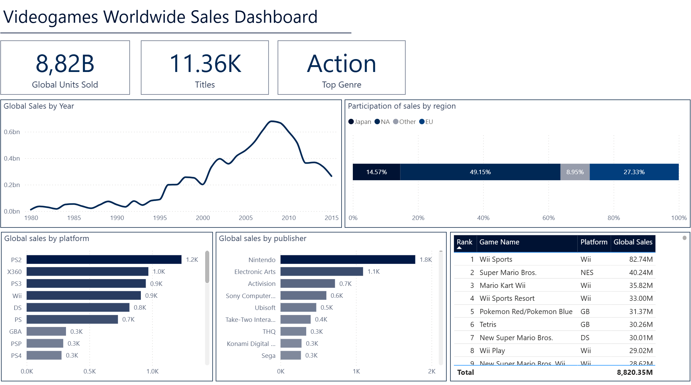
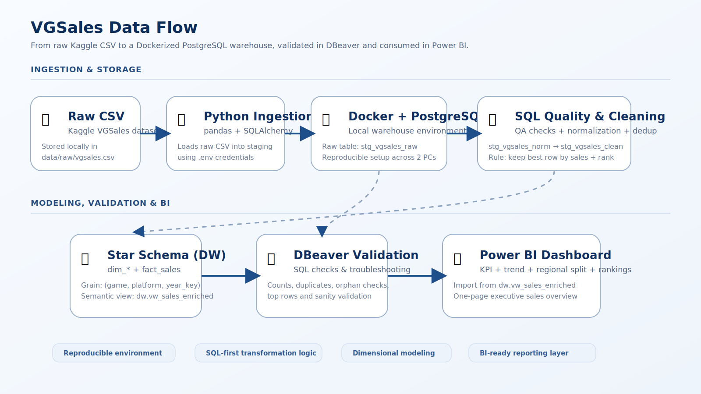

# 🎮 vgsales-data-project (Docker + PostgreSQL + SQL + Python + Power BI)

> Portfolio project built on the **Kaggle “Video Game Sales (vgsales)”** dataset.  
> The goal is to simulate a realistic analytics workflow end to end: **raw ingestion → data quality → clean staging → dimensional model → semantic SQL view → Power BI dashboard**.



---

## 🚀 Why this project matters

This repository was designed to demonstrate the kind of work expected in a junior-to-mid BI / Data Analyst / Analytics Engineering workflow:

- **Data ingestion** from a flat file into a relational database
- **Reproducible local environment** with Docker + PostgreSQL
- **SQL-first transformation logic** instead of doing everything in the BI layer
- **Data quality checks** before modeling
- **Deduplication with a documented business rule**
- **Star schema design** for analytical consumption
- **Semantic SQL view** prepared for reporting tools
- **Executive dashboard** in Power BI

For a recruiter or hiring manager, this project shows hands-on skills in:
- SQL modeling and transformation
- Data quality thinking
- Python-based ingestion
- Dimensional modeling
- BI-ready data delivery
- Dashboard communication and layout discipline

---

## 📌 Current Status

### Completed
- ✅ Dockerized PostgreSQL environment
- ✅ Python ingestion from CSV into raw staging
- ✅ Data quality / profiling SQL checks
- ✅ Clean staging layer with normalization + deduplication
- ✅ Star schema in `dw`
- ✅ Data mart load into dimensions and fact
- ✅ Semantic SQL view for reporting
- ✅ Power BI one-page dashboard

### Main SQL objects
- `stg_vgsales_raw`
- `stg_vgsales_norm`
- `stg_vgsales_clean`
- `dw.dim_platform`
- `dw.dim_genre`
- `dw.dim_publisher`
- `dw.dim_game`
- `dw.fact_sales`
- `dw.vw_sales_enriched`

---

## 🧱 Tech Stack

- 🐳 **Docker / Docker Compose**
- 🐘 **PostgreSQL**
- 🧠 **SQL**
- 🐍 **Python**
  - `pandas`
  - `SQLAlchemy`
  - `psycopg2-binary`
  - `python-dotenv`
- 📊 **Power BI**
- 🧰 **DBeaver**
- 🌱 `.env`-based local configuration
- 🧾 **Git + GitHub** as source of truth across 2 PCs

---

## 🔄 End-to-End Data Flow



### Pipeline summary
1. **Raw file**
   - `data/raw/vgsales.csv`
2. **Python ingestion**
   - loads the CSV into PostgreSQL staging
3. **Raw staging**
   - `stg_vgsales_raw`
4. **Quality checks**
   - NULLs, duplicates, outliers, regional/global consistency, text cleanup checks
5. **Normalized staging view**
   - `stg_vgsales_norm`
6. **Clean staging view**
   - `stg_vgsales_clean`
7. **Dimensional model**
   - `dw.dim_*` + `dw.fact_sales`
8. **Semantic reporting view**
   - `dw.vw_sales_enriched`
9. **Consumption**
   - DBeaver for validation
   - Power BI for dashboarding

---

## 🧬 Data Architecture

This project follows a warehouse-style structure with a SQL-first approach.

### 1) Raw staging
**Table:** `stg_vgsales_raw`

Purpose:
- preserve the original CSV load
- keep ingestion auditable
- separate raw ingestion from downstream business logic

### 2) Normalized staging
**View:** `stg_vgsales_norm`

Purpose:
- standardize text fields using `TRIM()`
- convert empty strings into `NULL`
- avoid polluting downstream joins and dedup logic

### 3) Clean staging
**View:** `stg_vgsales_clean`

Purpose:
- remove duplicate records at the defined grain
- preserve only the best candidate row per logical game record
- keep the cleaning logic transparent and reproducible

**Defined grain:**  
`(name, platform, year)`

**Deduplication rule:** keep the row with:
1. highest `global_sales`
2. highest regional sum (`na_sales + eu_sales + jp_sales + other_sales`)
3. lowest `rank` as final tie-breaker

A `dup_count` field is kept in the clean layer for auditability.

### 4) Star schema
**Schema:** `dw`

#### Dimensions
- `dw.dim_platform`
- `dw.dim_genre`
- `dw.dim_publisher`
- `dw.dim_game`

#### Fact
- `dw.fact_sales`

**Modeling decision:**  
`fact_sales` references `dim_game`, and `dim_game` stores the foreign keys to platform, genre and publisher.

**Final analytical grain:**  
One row per **game + platform + year_key**

`year_key = COALESCE(year, -1)` was used to handle records with missing year values consistently.

### 5) Semantic SQL layer
**View:** `dw.vw_sales_enriched`

This view joins fact and dimensions into a Power BI-friendly dataset, reducing transformation logic inside the dashboard file.

---

## 🧪 Data Quality Highlights

The project includes dedicated SQL checks for:
- total row counts and raw sampling
- null / missing year analysis
- negative sales validation
- duplicate rank detection
- duplicate `(name, platform, year)` detection
- conflicting duplicate investigation
- `global_sales` vs regional sum consistency
- empty / whitespace-only text values
- min/max year and top sales outlier checks
- null overview by column

### Observed findings
- The raw dataset has **~16K rows**
- A small percentage of records has missing `year`
- No negative sales values were found
- Duplicate game records exist at the logical grain and required explicit deduplication logic
- Some duplicate groups are conflicting, meaning a simple `SELECT DISTINCT` would not be enough

---

## 📊 Dashboard Overview

The current Power BI dashboard is a one-page executive overview built on `dw.vw_sales_enriched`.

### KPIs shown
- **Global Units Sold**
- **Titles**
- **Top Genre**

### Main visuals
- Global sales by year
- Regional sales share
- Global sales by platform
- Global sales by publisher
- Top-selling games table

### What the dashboard communicates
- long-term sales trend
- platform concentration
- publisher concentration
- regional participation split
- top-performing titles

---

## 🖼️ Dashboard Screenshot


---

## 📂 Repository Structure

```text
vgsales-data-project/
├─ data/
│  └─ raw/
│     └─ vgsales.csv
├─ sql/
│  ├─ 01_staging.sql
│  ├─ staging_quality_checks.sql
│  ├─ 03_create_stg_clean_view.sql
│  ├─ 04_create_dw_star_schema.sql
│  ├─ 05_load_dw_star_schema.sql
│  └─ 06_views_for_powerbi.sql
├─ src/
│  ├─ 01_load_staging.py
│  └─ Notebook.ipynb
├─ assets/
│  ├─ dashboard-overview.png
│  └─ data-flow.svg
├─ .env                                   # local only / ignored
├─ .env.example                           # safe placeholder version for repo
├─ .gitignore
├─ docker-compose.yml
├─ requirements.txt
└─ README.md
```

---

## ⚙️ Local Setup

### 1) Start PostgreSQL with Docker
```bash
docker compose up -d
```

### 2) Install Python dependencies
```bash
pip install -r requirements.txt
```

### 3) Create local environment file
Create a `.env` file with your database connection variables.

Suggested safe repo practice:
- keep `.env` in `.gitignore`
- commit only `.env.example`

### 4) Run ingestion
```bash
python src/01_load_staging.py
```

### 5) Run SQL scripts in order
1. `01_staging.sql`
2. `staging_quality_checks.sql`
3. `03_create_stg_clean_view.sql`
4. `04_create_dw_star_schema.sql`
5. `05_load_dw_star_schema.sql`
6. `06_views_for_powerbi.sql`

### 6) Connect reporting layer
In Power BI, connect to PostgreSQL and import:

- `dw.vw_sales_enriched`

---

## 🧠 Key Design Decisions

### Why keep logic in SQL?
Because SQL-based transformations are:
- easier to validate
- easier to version control
- reusable across BI tools
- closer to real warehouse practices

### Why use a clean staging view before the star schema?
Because modeling on top of unvalidated raw data creates silent reporting errors.

### Why deduplicate before loading dimensions/fact?
Because the dimensional model should represent a consistent business grain, not raw ingestion noise.

### Why a semantic SQL view for Power BI?
Because it keeps the BI layer lighter and makes the model easier to understand and maintain.

---

## ✅ What this project demonstrates

- Building a local analytical environment from scratch
- Moving data from CSV into PostgreSQL with Python
- Writing practical QA SQL checks
- Handling duplicate business records with explicit rules
- Designing and loading a star schema
- Preparing a SQL view for BI consumption
- Creating a clean and readable Power BI dashboard
- Structuring a project in a way that is easy to explain in interviews

---

## 📌 Next Improvements

Possible future enhancements:
- add automated script runner / orchestration
- add tests for critical SQL assumptions
- add snapshot or source freshness metadata
- publish a second dashboard page for deeper drill-down
- refactor ingestion into a more modular Python package structure

---

## 📄 Notes

- `data/raw/vgsales.csv` is intentionally not committed
- local credentials stay in `.env`
- GitHub is used as the canonical project version across multiple machines
